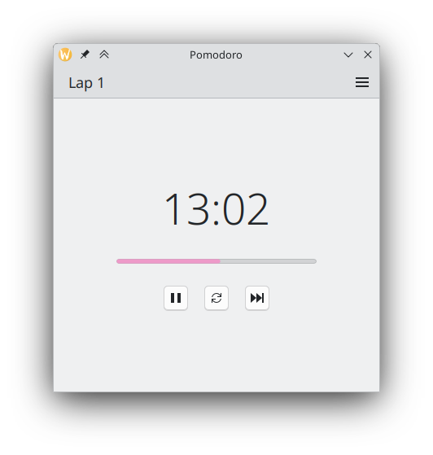

# Pomodoro Timer

Pomodoro is a free and open source pomodoro timer build with Qt/QML.



## Features

Some features that I wanted to have in,

1. Minimal interface
1. Lap counter
1. Customizable (TODO)
1. Notifications (TODO)

## Install

See Build section.

## Dependencies

All dependencies except Qt modules are downloaded and built using `conan`.

## Build

```bash
conan install . -of build
cmake --preset conan-debug
cmake --build build
```
